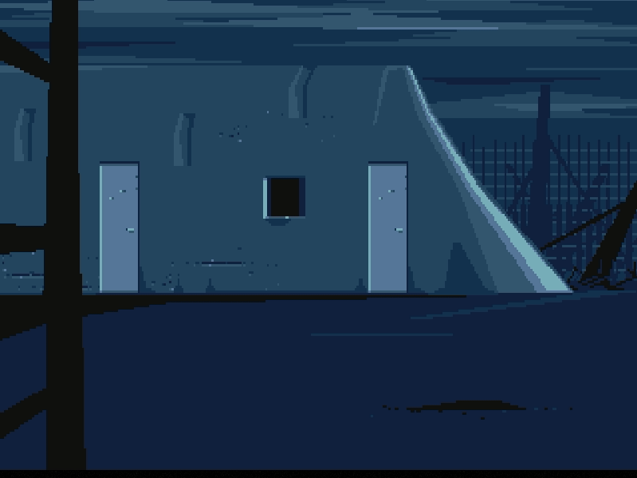

# Out of Rust World



## Overview

An implementation of engine from the "Another World" game ("Out of This World" in USA) in Rust language.

## Build & Run

```sh
cargo build --release
cd dir/with/another/world/data/files # memlist.bin
sources/target/release/oorw  # --help for more options
```

## Controls

* Space - Run
* Arrows - Move Left and Right, Jump and Crawl
* Esc - Exit the Game
* P - Pause the Game
